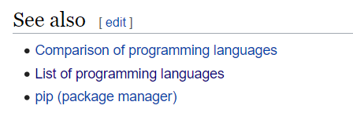
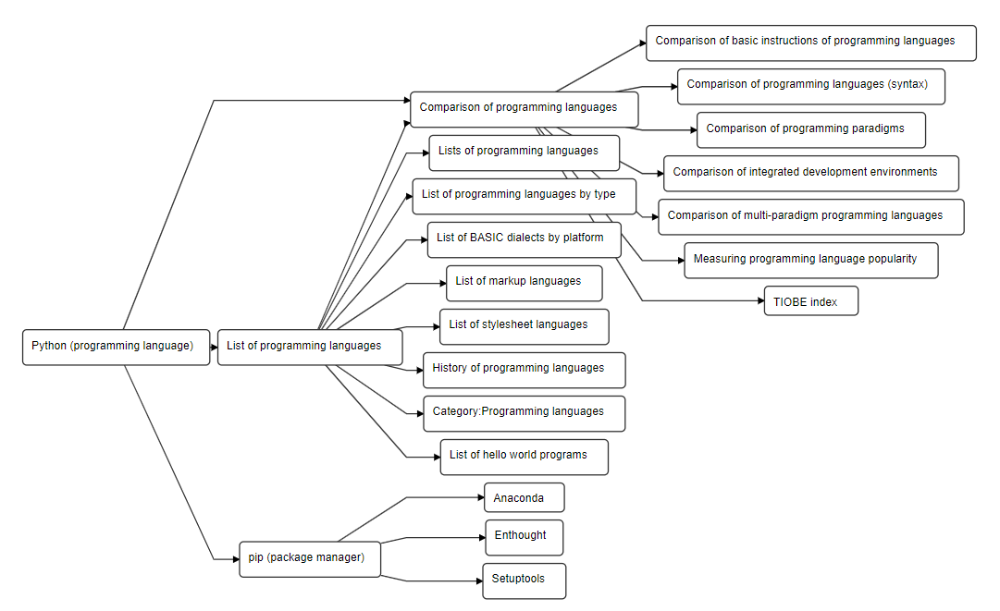
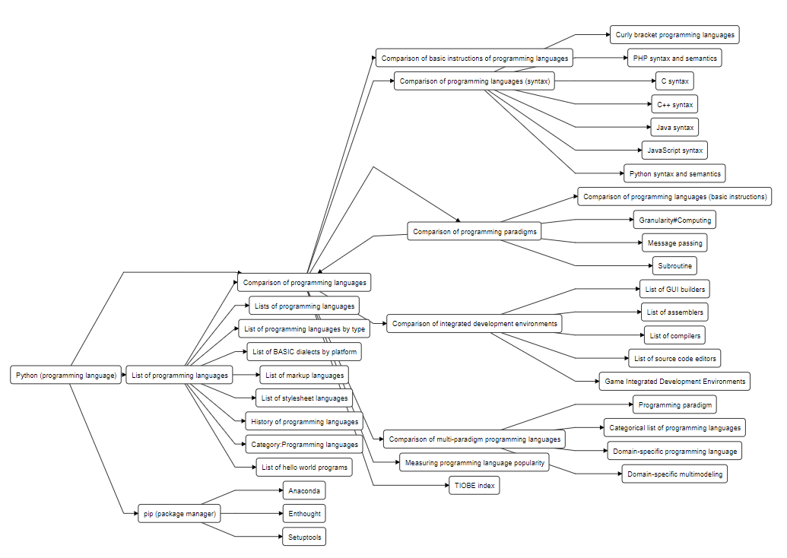
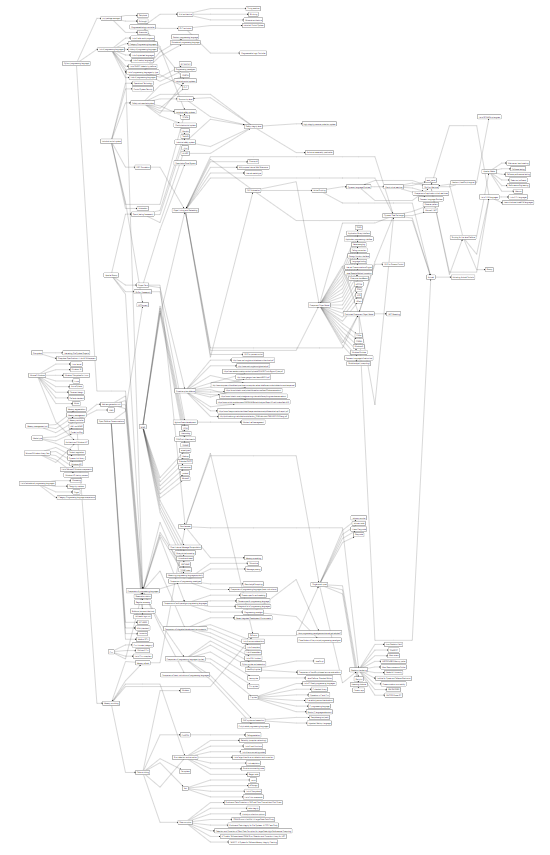

## Wikipedia "See also" links parser

### Installation

- Clone the repo
- `npm install`
- `npm start`
- find the data in `output.txt`

### Description

Most of wikipedia articles have "See also" block with links to connected topics.



Sometimes it's useful to see a big picture of articles for the theme of interest.

This repo builds connected graph of wikipedia articles.

For example, here's the visualization for 'Python'.

Nodes limit = 5



Nodes limit = 10



Nodes limit = 100



The script generates file `output.txt` with all connections between articles.
Use this data to visualize the graph in [Dagre](https://dagrejs.github.io/project/dagre-d3/latest/demo/interactive-demo.html)

Copy-paste the data to the textfield.

Optionally you can use following settings for the graph to look as on the screenshots above.
```
rankdir=LR
nodesep=10
ranksep=10
node [rx=5 ry=5 labelStyle="font: 300 14px 'Helvetica Neue', Helvetica"]
```

